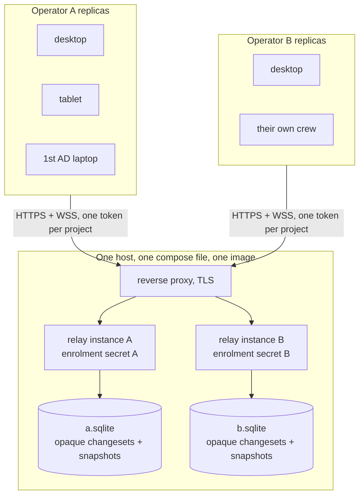
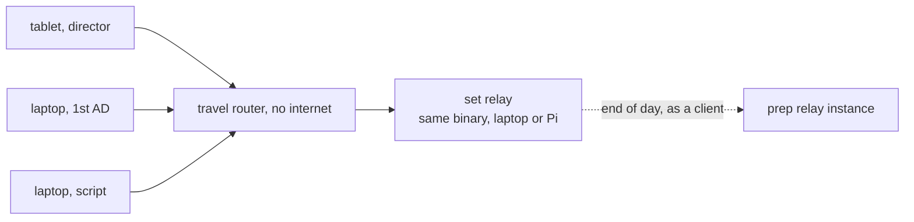

<!--
SPDX-FileCopyrightText: 2026 Benoit Rolandeau <borlnov.obsessio@gmail.com>

SPDX-License-Identifier: Apache-2.0
-->

# Collaboration and sync — shared projects, in prep and on set

This document is the implementation strategy for making a project shareable and collaborative. It
is written for the Sonnet 5 agents that will build it, orchestrated and reviewed by the main
session, with a user checkpoint between each milestone. **Read the repository `CLAUDE.md` first** —
this plan assumes its architecture, ways of working, coding standards, licensing rules and
verification gates, and does not repeat them.

The decisions this plan implements are recorded in
[ADR 0009](../adr/0009-offline-first-sync-through-a-domain-blind-relay.md) (how projects are
shared) and [ADR 0010](../adr/0010-sync-ready-data-model-prerequisites.md) (what the schema needs
first). When this plan and an ADR disagree, the ADR wins.

---

## 1. Why this step exists

Today a project is one local SQLite file opened by one person on one machine. The shoot itself is
what breaks that:

- On an exterior location the director works from a **tablet**, not a laptop: reading the shot
  list, and adding a shot when the day demands it.
- The **assistant directors change the shooting schedule at the same time**, from their own
  machines.
- Roles own different documents, but **every document is readable by everyone**.
- Connectivity on location is unreliable or absent, so nothing may depend on reaching the
  internet.

Before the shoot, the same project has to be shareable between people who are not in the same
room — the director at home, the production office, the first assistant director.

## 2. The strategy in one page

Restated from the ADRs so an agent has it in front of them.

**A domain-blind relay.** One self-hostable, single-tenant server per person or per production,
written in Dart, exposing five routes over one bearer token per project: append a changeset, read
changesets since a sequence number, upload a snapshot, fetch the latest snapshot, and a WebSocket
announcing new work. It never parses a changeset and never learns a table name, so the domain
model evolves without ever redeploying it.

**Offline-first, always.** Every device holds a full replica of the project. The app is fully
usable with no network; changes queue locally and merge on reconnect. This is not a degraded mode,
it is the normal one.

**The single machine never needs a server.** The all-in-one desktop build — one executable on
Linux, Windows or macOS, doing everything on the machine with no server anywhere — is a permanent,
first-class mode, never a degraded fallback. Every milestone below is additive to it: sync is opt-in
per project, the relay is reached only once a project is deliberately paired, and **nothing in this
plan may make a deployed server a requirement for using the app on one machine.** Syncing one
person's own devices with no server at all stays possible too, through the folder transport (§3.2).

**Merge is client-side and per column.** The director editing a shot's `framing` and the assistant
director setting that same shot's `shootingDay` must both survive. Whole-row resolution would drop
one of them.

**The server is portable.** On set it runs on a laptop at the video village or on a Pi in the
truck, with tablets reaching it over a travel router; in prep it runs on a small VPS. Same binary,
same client code path, a different address. Because there is always exactly one authority
reachable, there is never any peer-to-peer merge to write.

**Two documents are special.** `scenes` is derived from the screenplay text and is never
synchronised, only recomputed. `screenplays.fountainText` is a whole document, reconciled by a
three-way line merge against the nearest common `screenplay_snapshots` row rather than field by
field.

## 3. Architecture

The changeset engine, the relay and the pairing UI this section describes have shipped and are now
recorded in [`../architecture/sync.md`](../architecture/sync.md); what follows is kept as the design
context M5 and M6 extend. §5's deployment topology is what M6 builds on directly.

### 3.1 New packages

Two pure-Dart packages beside `packages/fountain_kit`, both free of any Flutter import, keeping the
existing rule that dependencies never reference their dependents:

- **`packages/ocpt_sync_protocol`** — the wire format alone: the changeset envelope, the snapshot
  descriptor, sequence numbers, error shapes, and their JSON codecs. Depended on by both the app
  and the relay, and by nothing else. It deliberately contains no table names and no domain types.
- **`packages/ocpt_sync_relay`** — the server: `shelf`, a SQLite file, the five routes, token
  checking, snapshot pruning. It depends on `ocpt_sync_protocol`; the app never depends on it.

The CI matrix, currently `{ ., packages/fountain_kit }`, gains both. The relay is a plain Dart
package, so its gate is `dart analyze` and `dart test`, not the Flutter ones.

### 3.2 New manager and services

`OcptSyncManager extends AbsWithLifeCycle`, registered with a builder factory and `dependsOn` the
projects manager, resolved through `globalGetIt()` like every other manager. It owns, following
the same one-service-per-responsibility split as `OcptExportManager`:

- `OcptChangesetService` — turns local writes into changesets, and applies incoming ones. Applying
  runs in a transaction with `PRAGMA defer_foreign_keys = ON`, since foreign keys are on since ADR
  0007 and a changeset can violate one part way through.
- `OcptMergeService` — per-column resolution against `row_field_versions`, plus tombstone
  handling.
- `OcptScreenplayMergeService` — the three-way line merge for `fountainText`, and the only place
  that can surface a conflict to the user.
- `OcptRemoteStorage` — the transport interface, with two implementations:
  `OcptFolderRemoteStorage` (a directory, used to exercise the engine with no network at all, and
  usable on desktop over any file-sync client) and `OcptRelayRemoteStorage` (HTTP plus WebSocket).

The screenplay text is still written only through `OcptScreenplayService.saveScreenplayText`, never
by hand, so scene reconciliation keeps running after a merge exactly as it does after an edit.

The three services that touch the database write to the project **file**, through
`OcptOpenProjectModel.fileDatabase` rather than its `database` slot. The two are the same
connection except while a version is being previewed, and that difference is the whole point: a
changeset arriving while the user reads an old version belongs to the working copy, not to the
read-only replica on screen. For the same reason, the `isReadOnly` guards in the domain services
are scoped to user edits and must never swallow an incoming merge — see
`OcptProjectDatabase.refusesUserWrite`, which asks "was this call handed the preview database?"
rather than "is this project read-only?". Both slots already exist and are the same connection
outside a preview, so nothing here changes.

### 3.3 The data model (already in place)

The sync-ready data model has shipped and is documented in `docs/architecture/foundations.md`:
`isDeleted` on every synchronised table, `sortKey` beside the retained `position` on the ordered
ones (fractional index, `lib/utils/ocpt_fractional_key.dart`), the `row_field_versions` sidecar,
and a per-replica `deviceId` in `OcptPropertiesManager`. Project versions were then built on top of
it — its payload codec and its tombstone-and-stamp restore both read these columns.

The schema is **frozen at version 1** (ADR 0029): no stable release has shipped, so instead of the
`v2→v3` migration with a `sortKey` backfill this plan first described, every column — the
sync-ready ones included — is declared at once in the v1 baseline. There is nothing left to migrate
here; the engine below builds on the columns as they already stand.

### 3.4 What synchronising does *not* cover

Two tables are named here so no agent has to guess later.

`scenes` is derived and recomputed, never synchronised (ADR 0010). `project_versions` is **local
to a replica**: a version is one person's working history, its payload is hundreds of kilobytes, and
pushing those through the changeset log would dominate the traffic for no collaborative gain.
`project_info`'s `currentVersionId` is local for the same reason — a restore on one machine must not
move another machine's pointer.

A restore is the one project-versions operation this plan has to know about. It rewrites most of the
project in a single transaction, and it is already written — before any sync code exists — as
tombstones plus per-column stamps rather than a delete-and-reinsert, so it merges like any other
edit. Two later hooks follow from it:

- **M3** must have a test for it: a restore on one replica converging correctly against a replica
  that was offline throughout, including rows the restore tombstoned.
- **M4** should publish a restore through the relay's *upload a snapshot* route rather than as a
  changeset. A restored project is by definition a complete, self-consistent state, which is what
  that route exists for, and it lets everything below it be pruned.

### 3.5 What the user sees

Sync is meant to be invisible when it works. The visible surface is deliberately small: a status
indicator in the workspace status bar (in sync, syncing, offline with a pending count, or an error),
a project-level pairing screen taking a relay address and token — by QR code on a tablet — and the
screenplay conflict view, which is the only conflict a user is ever asked to resolve.

## 4. Milestones

Each milestone ends with the full verification gate of `CLAUDE.md` §*Verification gates*, one
commit per logical change, and a user checkpoint before the next one starts.

**M1 through M4 have shipped** — their outcomes now live in `docs/architecture/`: the responsive
foundation and the Android build in `foundations.md`, the mobile share-sheet export in `exports.md`,
the cost-tracking cards in `budget.md`, the compressed phone layout in `screenplay.md`, and the
changeset engine, the domain-blind relay and the pairing UI in
[`sync.md`](../architecture/sync.md). Only M5 and M6 remain; both build on the engine and the relay
that `sync.md` records.

### M5 — Live push and presence

The WebSocket route driving the client instead of polling, and a presence indicator showing who
else has the project open and which mode they are in. This is what makes the set feel collaborative
rather than eventually consistent.

### M6 — The portable on-set server

Running the relay on a laptop or a Pi on set: discovery by QR code carrying the local address and
token, and upstream reconciliation where the set relay acts as a **client** of the prep relay at
the end of the day, reusing the M3 merge rather than a second implementation.

Document the set-up in `docs/` as an operator guide, not just as code: this is the milestone a
production actually has to follow on the ground.

---

## 5. Deployment topology

### 5.1 Hosting more than one person on one machine

The relay is one binary, one port and one SQLite file, so a second person is a second service in
the same compose file: same image, differing only by volume, enrolment secret and hostname. It is
deliberately not a second tenant inside one instance — with no accounts there is nothing inside an
instance to separate two people by, and the enrolment secret that lets someone create their own
projects is instance-wide by construction (ADR 0009).

Splitting also buys what sharing cannot. An instance upgrades or restarts without touching the
other, which matters when one of them is mid-shoot; a mistake in token checking cannot reach
across; and handing someone their independence later is moving one volume and one service, not
extracting rows from a shared database. The cost is a second container to keep patched, which for
one shared image is the same `docker compose pull` as for one.

### 5.2 Authentication, end to end

There are exactly two secrets, and **neither is ever typed by a human into the server**.

| | Enrolment secret | Project token |
| --- | --- | --- |
| Scope | one instance | one project |
| Generated by | the operator, at deploy time, as an environment variable | the client app, at pairing time |
| Handed to | the one person that instance is for, once, out of band | each crew member invited, by QR code |
| Opens | creating *new* projects on that instance | reading and writing that project, entirely |
| If it leaks | someone can fill that disk with projects, and reads none of the existing ones | that project is fully exposed, the others are not |

So nobody creates a project on an instance without its enrolment secret, and nobody touches a
project without that project's token. The two blast radii are deliberately different: the enrolment
secret costs disk, the project token costs a film.

The relay stores only a hash of each project token. A fast hash is enough — the token is
full-entropy machine output, not a human password, so there is no dictionary to defend against —
and failed authentications are rate-limited, which doubles as the cheapest denial-of-service guard
the server has. TLS is terminated by the reverse proxy and is what keeps a token off the wire.

Rotating a project token means re-pairing the crew; rotating an enrolment secret costs nothing,
since it is only ever read when a project is created.

### 5.3 A day on set, concretely

No special build: the set relay is the same image as the prep relay, started on the video-village
laptop or a Pi.

1. **Before leaving.** Everyone syncs with the prep relay, so every device carries a full replica
   and the day can start even if nothing else ever works.
2. **On location.** The travel router gives the set relay a LAN, and each device points that
   project at the new address. The project identifier and its token do not change — only where they
   point. The first device to append uploads a snapshot, which is how an empty set relay learns the
   project.
3. **Through the day.** Nothing reaches the internet. A device keeps one delivery cursor *per
   relay*; the merge stamps are relay-independent, which is what lets the same project live behind
   two relays in one day (ADR 0010).
4. **Evening.** The set relay is pointed at the prep relay and runs as a **client**: it pushes what
   it gathered, pulls what it missed, and merges with the same engine M3 built. No second
   implementation, and no "who is the master" question to answer.

The set relay is an optimisation, not a requirement. Every device holds a full replica, so if the
laptop is dropped in the sand, any tablet that was on set reconciles the whole day upstream on its
own.

---

## 6. Out of scope

Stated so no agent drifts into them:

- Real-time co-editing of the screenplay text with multiple cursors. The three-way merge is the
  answer, and screenplays are single-owner in practice.
- Per-document access control. Whoever holds the project token holds the whole project; keeping a
  document away from the crew means a separate project file (ADR 0009).
- User accounts, passwords, password recovery, and anything that would store personal data.
- A multi-tenant hosted service, and Google Drive or any other cloud provider's API.
- The budget and shooting schedule modes' own content — this plan syncs what exists, it does not
  build new modes.
- Retiring the `position` column, which waits for a deliberate breaking version (ADR 0010).
